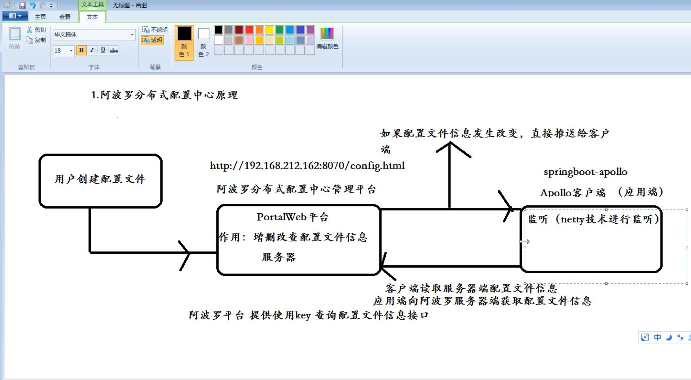
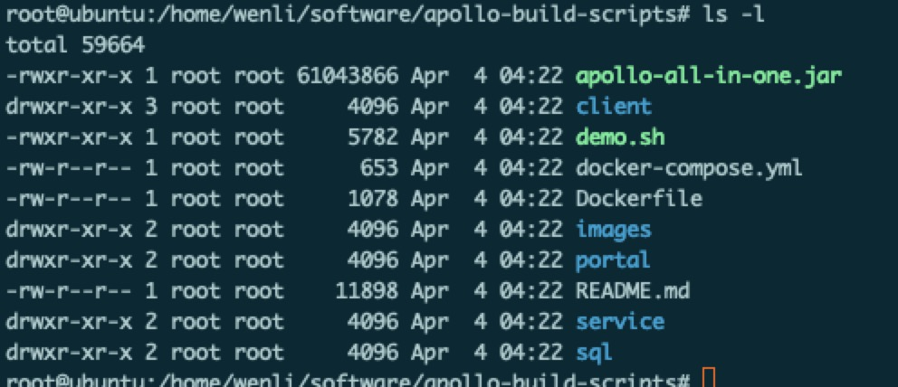

## 1、分布式配置中心
### 1.1传统的配置文件缺点
修改配置文件需要重新打包重新发布
### 1.2分布式配置中心
将配置文件信息统一注册到配置中心平台,然后使用分布式注册中心实时更新配置文件,统一管理配置文件

## 2.常见的分布式配置中心
- Applo(携程)
- zookeeper
- disconf(依赖zk)
- diamod(阿里)
## 3.分布式配置中心原理


## 4.apollo 安装

### 4.1 准备数据库
从github上下载apollo-build-scripts项目,项目目录如下:

在sql下有两个文件:apolloconfigdb.sql(存放配置文件信息).sql和apolloportaldb.sql(存放门户网站信息)
依次到mysql环境下执行如下命令
```
source apolloconfigdb.sql
source apolloportaldb.sql
```